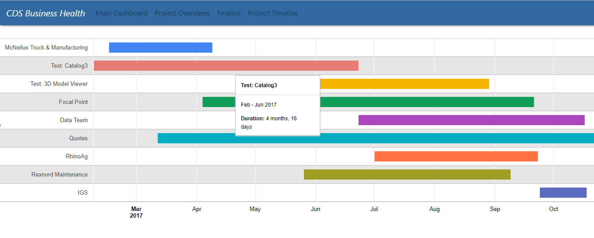
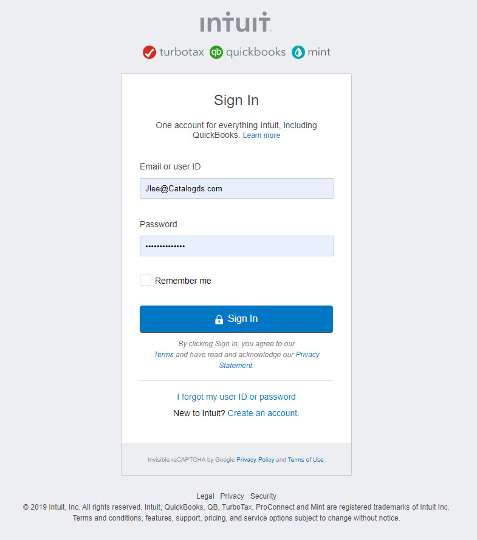

# CDS BUSINESS HEALTH APP

## Information
This application was develop by a team in the UCLA Extension Full Stack Web Development program. It was build for a company, Catalog Data Solutions to help them organize data for an exective user to understand the state of the entire business.

Link to main dashbord: https://jonathynlee.github.io/CDSBusinessHealthApp/

## TABEL OF CONTENTS
1) Main Dash Board
2) Project Page
3) Calender
4) Finance Page

---
---

# 1) CDSBusinessHealthApp - Main Dashboard 

## About: 
This page represents the main dashboard, it includes 5 sections: 

    Overall Health Grade (Location: top row, left column): This section represents the overall health of all the projects. The data is averaged from the health of each given project; each projects health in particular is represented in the next section; Project Health Levels.

    Project Health Levels (Location: top row, middle column): Alot like the overall health grade section, these levels represent the healthgrade of each individual project. The Data is averged from these healthgrades to represent the overall healthgrade.

    Pending Payments (Location: middle row, left column): The pending payments section is representative of status of budget in each departmet on whether they are behind payments or ahead.

    General Financial Data (Location: bottom row, left column): This line graph shows the data representing the fluxuation of CAD Downloads within the last 12 days.

    Pinned Projects (Location: right column): This table has two columns: the left column representing the title of the given project and the right column representing the status of completion in relation to the projected deadline; Each row representing a seperate task/project. The data for this section is in relation to the project overviews page, please visit that page for more information regarding each project.

## Functionality:
The purpose of this page is to portray general information/progress of the given projects that are going on in the the company. It is meant to help facilitate the process of managing projects, to help give the user a good general idea of information regarding each given section.

---
---

# 2) CDSBusinessHealthApp - Projects

## CDSBusinessHealth Application ##

This program part lists projects with options to access to the subtasks and people working on the project. It gives information about the status of the project which could be (overdue, onschedule or falling behind). it also gives information about the priority of the project(High,Medium,Low). All critical tasks are color coded. Red designates very critical, yellow is about to be critical and green is normal. This view will help project managers to see critical tasks which might be overdue or high priority. He can pin particular projects to track on the dashboard. Also he can track the todoSets(tasks) to see their completion status, completion rates and how many todoLists(subtasks) exist under that todoSet(task). Also he can reach member(Employee) information per project.

## ScreenShots: ##

  
--

  

--
 

## Functionality ##

* Listing projects on the screen with ids, status and priority and showing critical tasks with color codes.

    * When a project button is clicked, listing information about a certain project's task sets; such as its id, if it's completed or not and its completion ratio and also  number of sub tasks (todo lists).

    * When members button is clicked showing the members working on the project with their employee id, title etc 

    * By clicking pinned icon we pin or unpin the project entries to determine which ones are going to be shown on the dashboard. This is a useful tool for the project manager to customize which projects he wants to track of. 

## How To: ##

In this program, given projects (by API with call "GET /projects.json" you can access todo-sets (which is our main task), from todo-sets, we can access todo-lists(which are similar to subtasks) Each project will have id, name, start date, url for the task lists(sub tasks), status, priority, pinned fields and array of members working on the project. We list people with their ID's, email addresses, names, titles and roles which is designated by variable 'personableType'.

* "getAllProjects" function extracts data from the basecamp api about all projects and stores the project objects  in 'APIProjects' 'array.

* "viewProjects'" function displays on the page the information about projects which are stated in the 'functionality' section above. In 'globalData[ "projectData" ]' the data that will be used to display the pinned projects populated and stored in the local storage. Project table is populated dynamically.

* "getTodoSets" function extracts the information about tasks (todo sets) and stores them in 'usefulArray'. The information is the id, if the tasks(todo sets) completed, how much of it is completed (ratio) and number of sub tasks(task lists) and url for the sub tasks(task lists). To get the information, all the projects are searched for the url for the todoSets(tasks). While doing that 'getProjectsMembers' function is called

* "getProjectMembers" function makes an ajax call "GET /people.json" with the project id whose index is passed by  the getTodoSets function. Employee information(id, name, email etc) pushed into memberInfoArray.

* In the main projects page, when project button is clicked 'viewTasks' function is fired up. By using 'usefulArray' array, we can list information about the todoSets(sub tasks) in a modal which again is populated dynamically. 

* In the main projects page, when members button is clicked,'viewMember' function is fired up. Project index is passed as argument. The member information about the nth project resides in the nth element of the memberInfo array. The information returned from the API was in object format instead of JSON format, we needed to convert it to string and then convert it  back to object to extrct the fields. Member or Employee information is shown in  the table in modal-body which is populated dynamically. 

* To pin the projects in the dashboard the pin images in the main page can be clicked. Project's pinned attribute set to true if it's pinned and false, if it's unpinned and global data is adjusted accordingly.

* The status and priority of the projects are created randomly for now but will be read from database in the future.

## Challanges: ##

* The API data was deeply nested. For each project, you need to make API calls to get information about todoSets(tasks), for each todoSets you have to make API calls to get todoLists(sub tasks). By the same method you can get information about sub sub tasks but the number of API calls increase so rapidly and basecamp allows developers to make only 50 calls in 10 seconds and at some point you exceed the limit and start getting UNAUTHORIZED errors

* The format of the result that's returned from the API calls was not always in json format, sometimes it was in the form [object Object] and we had to convert it to string(with JSON.stringify) and converted it back to object(with JSON.parse). That was the only way to extract the fields from the data.

## Credits: ## 

We are greatful for our instructor Omar Patel and TA's Tyler Bray, Matthew Calimbas and PeterPark for their help on the issues encountered in the process of developing this application.

The web sites that We found useful while implementing the application are listed below:

-  https://github.com/basecamp/bc3-api
- https://github.com/basecamp/api/blob/master/sections/authentication.md
- https://developers.google.com/chart/interactive/docs
- https://fontawesome.com/icons/dollar-sign?style=solid
- https://www.sitepoint.com/use-jquerys-ajax-function/
- https://stackoverflow.com/questions/20155531/converting-curl-cmd-to-jquery-ajax

- https://api.jquery.com/jQuery.post/
- https://getbootstrap.com/docs/4.0/content/tables/

## TODOs: ##

- PROJECT VIEW: 

  - Getting the projet status and priority from the database for each project
  - To construct a barchart to show the completion rates of each todoSets(tasks) with their start dates and deadlines. Color coding the barcharts to show if the task is falling behind, overdue or on schedule.

  
  
  ---
  ---
  
  

# 3) CDSBusinessHealthApp - Projects Timeline

This program part displays the current project timeline. The y-axis displays the current projects by name while the x-axis shows the time interval each project took to complete. Currently the data displayed is dummy data that will be filled out at a later date when the application becomes secure to be able to display the true data off of Basecamp. 

## ScreenShots: ##

  
--

  

## Functionality ##

* The timeline shows the projects along with the dates of when each was began and finished.

    * When the cursor is hovered over each colored bar graph a small window pops up displaying the specific start and end dates and how long each project took.

## Credits: ## 

The timeline bar graph was simplified using the Google Charts library instead of creating it from scratch. 

- https://www.gstatic.com/charts/loader.js

## TODOs: ##

- TIMELINE: 

  - Be able to access the actual data off of the Basecamp API
  - Allow the user to dynamically add projects along with their start and end dates and be able to display them in timeline.
  
---
---

# 4) CDSBusinessHealthApp - Finance
  
  URL: https://jonathynlee.github.io/CDSBusinessHealthApp/finance/finance.html

## Descrition 
In this section of the website, you will find data representing the financial state of the shown business (CDS). There are 6 tiles, each
of which will display unique data directly from the users quick books account. 

In each tile, a different data set is represented. Please see (additional information on this topic)

## Instuction 

As a user, when you initially log onto the site, it should initially propt you to authorize your profile by logging in through quickbooks
(shown below)

Once you are logged it, CDS Business Health will have access to all data.

## Additional Information 

(Topic referenced) - There is a lack of connection to the quickbooks API due to the fact the quickbooks api only allow Oauth2 ajax requests
from server side applications. Until we know Node.js, the functionality will be cut. 

THERE ARE PLANS FOR FUTURE CHANGES. Stay tuned.

  
