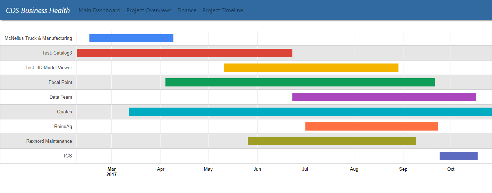
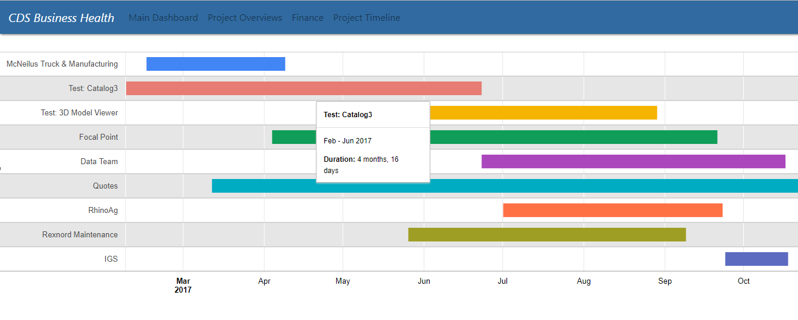

## CDSBusinessHealth Application ##

## ABOUT: ##

## INSTALLATION: ##

## APPLICATION VIEWS ##

## Timeline ##

This program part displays the current project timeline. The y-axis displays the current projects by name while the x-axis shows the time interval each project took to complete. Currently the data displayed is dummy data that will be filled out at a later date when the application becomes secure to be able to display the true data off of Basecamp. 

## ScreenShots: ##

  
--

  

## Functionality ##

* The timeline shows the projects along with the dates of when each was began and finished.

    * When the cursor is hovered over each colored bar graph a small window pops up displaying the specific start and end dates and how long each project took.

## Credits: ## 

The timeline bar graph was simplified using the Google Charts library instead of creating it from scratch. 

- https://www.gstatic.com/charts/loader.js

## TODOs: ##

- TIMELINE: 

  - Be able to access the actual data off of the Basecamp API
  - Allow the user to dynamically add projects along with their start and end dates and be able to display them in timeline.
