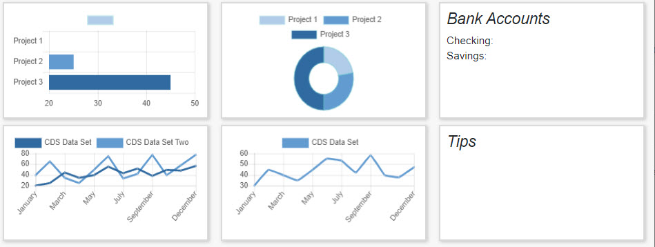
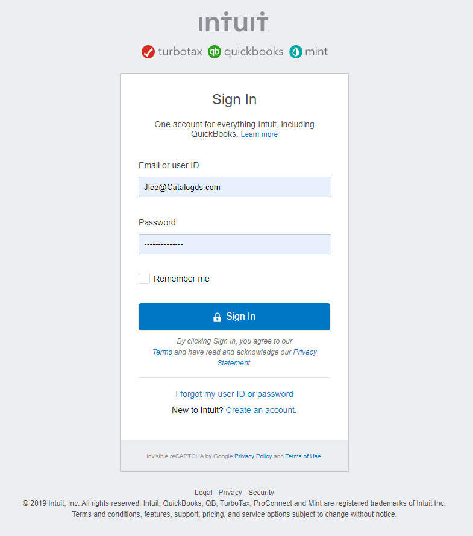

URL: https://jonathynlee.github.io/CDSBusinessHealthApp/finance/finance.html

////////////// Descrition ///////////////////////
In this section of the website, you will find data representing the financial state of the shown business (CDS). There are 6 tiles, each
of which will display unique data directly from the users quick books account. 

In each tile, a different data set is represented. Please see (additional information on this topic)

/////////////  instuction /////////

As a user, when you initially log onto the site, it should initially propt you to authorize your profile by logging in through quickbooks
(shown below)

Once you are logged it, CDS Business Health will have access to all data.

///////////// Additional Information ////////////////

(Topic referenced) - There is a lack of connection to the quickbooks API due to the fact the quickbooks api only allow Oauth2 ajax requests
from server side applications. Until we know Node.js, the functionality will be cut. 

THERE ARE PLANS FOR FUTURE CHANGES. Stay tuned.

